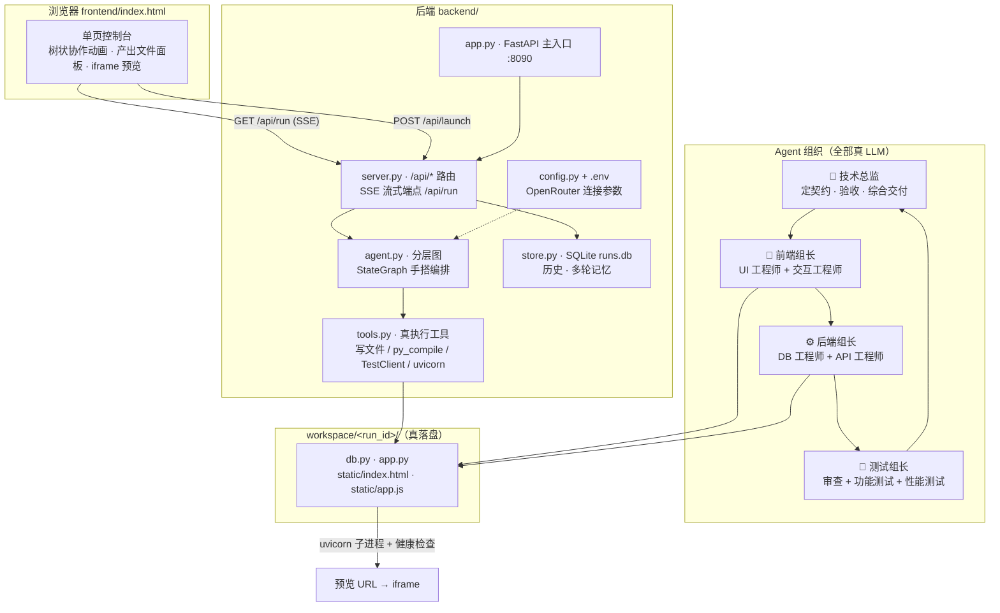

<div align="center">

# 🏢 Brief2app · 软件交付多团队

**输入一句需求，一个 LLM 虚拟软件团队真的交付一个能跑的 Web 应用**

*From Brief to Running App — A Hierarchical Multi-Agent Software Delivery Team* / LangGraph + FastAPI + SQLite + OpenRouter

[](https://www.python.org/)
[](https://langchain-ai.github.io/langgraph/)
[](https://fastapi.tiangolo.com/)
[](https://www.sqlite.org/)
[](https://openrouter.ai/)

[快速开始](#-快速开始) · [架构总览](#-架构总览) · [核心技术亮点](#-核心技术亮点) · [项目结构](#-项目结构)

</div>

---

## 💡 这是什么

Brief2app（Hierarchical · 软件交付多团队）是一个基于 LangGraph StateGraph 的**分层多 Agent 软件交付系统**：技术总监根据你的需求动态制定接口契约，前端/后端/测试三个组长各带工程师**真写代码、真跑测试、真做代码审查**，最后交付一个 FastAPI + SQLite 的可运行小应用——页面上点「🚀 启动预览」就能直接用。

> **它不做"嘴上规划"**：不是让 AI 列一份开发计划就完事，而是像真实软件公司一样——契约评审、分工实现、组长自检、测试打回、总监验收，每一环都有真实产物与真实执行。

**适合谁**：想读懂/复刻多 Agent 编排（分层图 + 返工循环 + 事件流）的工程师；需要"AI 生成可验证软件"教学案例的团队。

## 🏗️ 架构总览



## ✨ 核心技术亮点

- 📝 **动态接口契约** — 技术总监按任意需求生成 JSON 契约（表/字段/端点/页面元素），`_normalize_contract` 校验补全、失败回退内置契约；四个工程师的 SPEC 从同一契约渲染，联调天然一致（`backend/agent.py`）
- 🕸️ **StateGraph 手搭分层图** — 组间串行（前端→后端→测试→总监）、组内 `asyncio.gather` 并行；不用 `create_supervisor` 的模型自主 handoff，弱模型上编排 100% 确定（`agent.py:_build_graph`）
- 🔁 **测试驱动返工** — 功能测试用 TestClient 真打生成的 app，失败带错误堆栈**跨组打回**后端重写再重测；组长自检不合格打回重写最多 2 次（`agent.py:_make_lead_node`）
- 🧰 **真执行工具链** — `write_code_file` 产 unified diff、`static_check` 真跑 py_compile + pyflakes 子进程、`run_perf_test` 真压测统计 p95、`launch_app` 真起 uvicorn + 14s 健康检查（`backend/tools.py`）
- 📡 **SSE 生产者-消费者事件流** — `asyncio.Queue` 边产边发，派活/调工具/写文件/测试结果全程实时可见；事件流落 SQLite，历史回放复用同一数据（`server.py:/api/run` + `runtime.py`）
- 🏝️ **contextvars per-request 隔离** — 事件队列/工作区/产物清单/测试结果六件套随请求隔离，深层节点零传参（`backend/runtime.py`）
- 🌱 **多轮增量演进** — 上一版源码播种新工作区 + 契约沿用 + 正则确定性修改兜底，追问"把标题改成 X"得到的是增量修改而非重新生成（`server.py:_seed_workspace_from_previous` + `agent.py:_apply_revision_hints`）
- 🛟 **处处降级链** — 契约解析失败回退、汇总类 LLM 失败降级不中断整轮、pyflakes 缺失静默跳过（`agent.py:_llm_or_fallback` 等）

## 🚀 快速开始

### 0️⃣ 环境要求

| 组件 | 版本 | 说明 |
|---|---|---|
| Python | 3.12 | 其他 3.10+ 一般可用，未验证 |
| OpenRouter Key | — | [openrouter.ai/keys](https://openrouter.ai/keys) 免费注册获取 |

### 1️⃣ 安装依赖

```bash
python3.12 -m venv .venv
.venv/bin/pip install -r requirements.txt
# Windows PowerShell:
#   python -m venv .venv
#   .venv\Scripts\pip install -r requirements.txt
```

### 2️⃣ 配置密钥

```bash
cp .env.example .env
# 编辑 .env，填入你的 OPENROUTER_API_KEY
# Windows 用: copy .env.example .env
```

### 3️⃣ 启动

```bash
.venv/bin/python -m uvicorn backend.app:app --host 127.0.0.1 --port 8090
```

### 4️⃣ 体验核心链路

1. 打开 `http://127.0.0.1:8090`，输入需求：`做一个待办清单：能添加任务（标题/优先级）、查看列表、删除任务`
2. 观看树状协作动画：定契约 → 三组长接力 → 组内并行 → 写文件/测试/审查事件实时弹出
3. 交付完成后阅读技术总监的 Markdown 总结，点「🚀 启动预览」在 iframe 里使用真应用
4. 追问增量需求（如 `把标题改成「我的番茄钟」`）验证多轮演进

### 5️⃣ 无浏览器自测

```bash
.venv/bin/python -m backend.agent
# 用"待办清单"需求跑通动态契约全链,终端打印全部事件与产物
```

## ⚙️ 配置说明

| 变量 | 必填 | 默认值 | 说明 |
|---|---|---|---|
| `OPENROUTER_API_KEY` | ✅ | —（缺失启动即报错） | OpenRouter API 密钥 |
| `MODEL` | ⬜ | `deepseek/deepseek-v4-flash` | 任意 OpenRouter 上的模型名 |
| `OPENROUTER_BASE_URL` | ⬜ | `https://openrouter.ai/api/v1` | 任意 OpenAI 兼容端点 |

💡 最低可用配置 = 只填一个 `OPENROUTER_API_KEY`。其余路径（data/logs/workspace）由 `config.py` 启动时自动创建，无需手工配置。

## 📁 项目结构

```
Brief2app/
├── 📂 backend/
│   ├── __init__.py     # 模块地图（各模块职责速览）
│   ├── config.py       # 配置单一真相源：路径 + LLM 参数(.env)
│   ├── runtime.py      # per-request 上下文：contextvars × 6 + SSE 帧
│   ├── app.py          # 主入口：组装 FastAPI + 前端页
│   ├── store.py        # SQLite 持久层：历史 / 多轮记忆 / 删除
│   ├── server.py       # 全部 /api/* 路由 + SSE 流式端点
│   ├── tools.py        # 真执行工具：写文件/静态检查/测试/压测/起应用
│   ├── agent.py        # 🧠 核心：契约 + 组织结构 + 分层图 + 返工循环
│   ├── data/runs.db    # (运行时) 每轮交付存一行
│   └── workspace/      # (运行时) 每次构建一个可运行应用
├── 📂 frontend/index.html   # 前端单页：树状动画 + 产出面板 + 预览
├── requirements.txt
└── .env.example
```

更深入的逐文件导读（行号级阅读顺序、返工循环机制、`___RESULT___` 子进程协议、常见问题）见 **[ZHIDAO.md](ZHIDAO.md)** 📖

<details>
<summary><b>🤖 Agent 组织结构一览</b>（点击展开）</summary>

| 层级 | 角色 | 成员 | 产出/工具 |
|---|---|---|---|
| 顶层 | 👔 技术总监 | — | 定契约 JSON、`acceptance_check` 验收、综合 Markdown 交付总结 |
| 前端组 | 🎨 前端组长 | UI 工程师 | `static/index.html`（页面/样式） |
| | | 交互工程师 | `static/app.js`（取数/提交/统计） |
| 后端组 | ⚙️ 后端组长 | 数据库工程师 | `db.py`（SQLite 持久层） |
| | | API 工程师 | `app.py`（FastAPI 服务） |
| 测试组 | 🧪 测试组长 | 代码审查 | py_compile + pyflakes + LLM 评审 |
| | | 功能测试 | TestClient 真打 app，验证读写打通 |
| | | 性能测试 | 连打 40 次，统计 avg/p95/max 延迟 |

组长自检（`inspect_frontend` / `inspect_backend` / `quality_gate`）不通过即打回重写，最多 2 次；功能测试失败还会带错误堆栈跨组打回后端组。

</details>

<details>
<summary><b>🔌 API 一览</b>（点击展开）</summary>

| 方法 | 路径 | 说明 |
|---|---|---|
| GET | `/api/run?query=&session=` | 跑一次完整交付，SSE 流式返回全过程事件 |
| POST | `/api/launch?run_id=` | 用 uvicorn 真起某次构建的应用，返回预览 URL |
| POST | `/api/stop?run_id=` | 停止预览进程 |
| GET | `/api/files?run_id=` | 取某次构建产物文件的当前内容 |
| GET | `/api/agents` | 技术总监/组长/成员的角色、系统提示词、工具列表 |
| GET | `/api/conversations` · `/api/conversation/{session}` | 会话列表 / 详情（回放动画） |
| DELETE | `/api/conversation/{session}` | 删除会话 |
| GET | `/api/health` | 组织规模 / 模型 / 能力自述 |

</details>

## 🛣️ Roadmap

- [x] StateGraph 手搭分层编排（组间串行 + 组内并行）
- [x] 动态契约 + 回退契约 + 多轮增量修改
- [x] 真执行工具链（静态检查 / 功能 / 性能 / 启动预览）
- [x] 测试驱动返工 + 组长限次返工
- [ ] 支持多表契约与关联关系
- [ ] 生成应用支持用户自定义技术栈模板
- [ ] 返工策略可配置（次数/打回范围）

---

<div align="center">

**如果这个项目帮你理解了多 Agent 编排，欢迎点一个 Star ⭐**

用你的方式参与贡献：Fork → Branch → PR · 问题反馈请提 Issue

</div>
